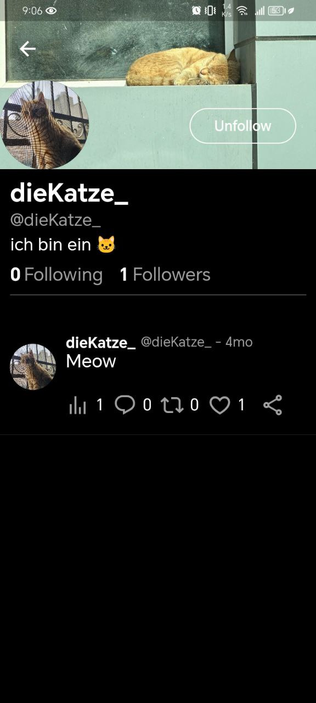

<div align="center">
    

<p>The <span style="text-decoration: line-through;">Buggy</span> X clone.</p>
</div>

---

This App is mostly the result of this [Tutorial](https://youtu.be/XnxZLhtkFeg?feature=shared).

---

<details>
<summary>📸 Screenshots</summary>




</details>

### Installation

```bash
git clone https://github.com/Ahmad-Mtr/K.git x_clone # All dependecies use x_clone as the root address, and I'm lazy enough to change it.

flutter pub get
```
